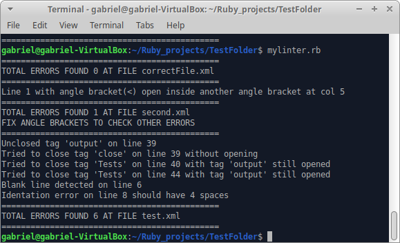
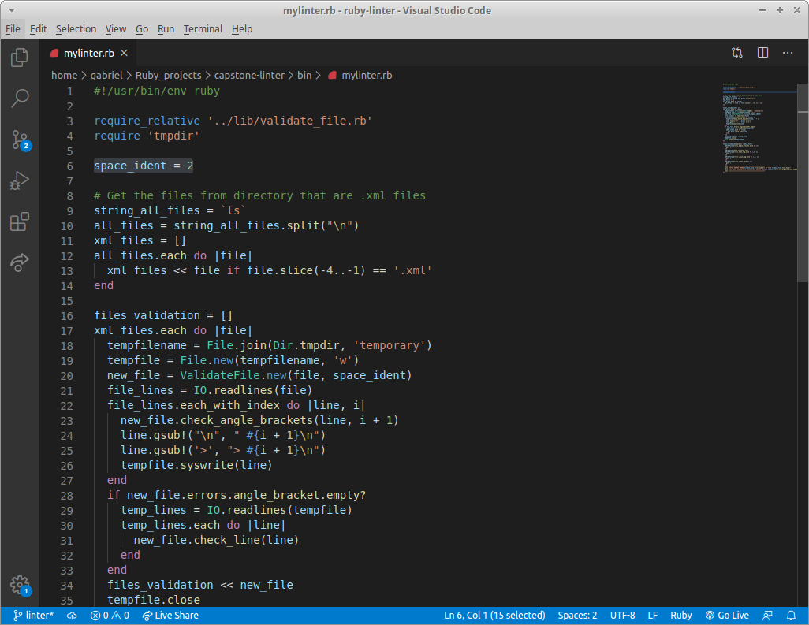

# XML Linter

## Table of Contents

- [Description](#Description) 
- [Rules](#Rules) 
- [Instructions](#Instructions) 
- [Built With](#Built-With)
- [RSPec Tests](#RSPec-Tests)
- [Authors](#Authors)
- [Show your support](#Show-your-support)
- [Acknowledgments](#Acknowledgments)


## Description

In this project, the objective was to create a linter for beginners it provides feedback about errors in a file.  I created a linter to check .xml files and validate:
 
 - Balance of angle brackets (If every open angle bracket has a closing pair);
 - Tags that are opened inside itself;
 - Tag names validity (Tag name can't start with space or a number);
 - Tags not closed;
 - Tag close unmatching the last open tag;
 - Tags closed that aren't open;
 - Empty lines;
 - Indentation (On newline, for every open tag it needs more 'x' spaces to start writing).
 - Root element (XML file should have a Tag element that encompasses all other tags)

After running some tests I realized that the Balance of angle brackets would lead to errors everywhere, so to make it more user friendly I separated the linter on 2 phases. First, it checks the Balance and shows those errors for the file. It just checks the other issues if passes on the Balance validation. It messages the user about fixing those errors and runs again to check the whole file. I decided to make this linter to test my skills and I'm aware there is room for improvements, would like to make more validations to make it more useful in the future. On a future feature will be good to include validation for: 
- atributes values;
- XML declaration;
- auto-correct for the indentation;



## Rules

The user can change the indentation rule (Default is 2 spaces indentation)
To do it you can open the file mylinter.rb (located inside the /bin folder of where you cloned the repository) on any text editor, change the line 6 for the space indentation needed and after that save the file.



**_Unbalanced Angle Brackets at line_**

When the line of the file has open-angle brackets without closing

> Bad code:

```
<Test> </Test  
```

> Good code:

```
<Test> </Test> 
```

or when there is another angle bracket open inside other (without a closing one in between)

> Bad code:

```
<Tes<t> 
```

> Good code:

```
<Test>
```

**_The same tag name can't be open inside itself_**


> Bad code:

```
<Test>
  <Input>2</Input>
  <Test>Name</Test>
</Test> 
```

> Good code:

```
<Test>
  <Input>2</Input>
  <Output>Name</Output>
</Test>
```

or 

```
<Test>
  <Input>2</Input>
</Test> 
<Test>Name</Test>
```

**_Tag Names should not start with empty space or a number_**

> Bad code:

```
< Test> </Test> 

<4Tag>
```

> Good code:

```
<Test> </Test> 

<Tag>
```

**_All tags should be closed_**

> Bad code:

```
<Test> 
  <Info>
    <Name>Gabriel</Name>
</Test> 
```

> Good code:

```
<Test> 
  <Info>
    <Name>Gabriel</Name>
  </Info>
</Test> 
```

**_Tag close unmatching the last open tag name_**

> Bad code:

```
<Test>
  <Tag>Something</Test>
</Tag>
```

> Good code:

```
<Test>
  <Tag>Something</Tag>
</Test>
```

**_Tag close that wasn't open_**

> Bad code:

```
<Tag>Something</Bag>
```

> Good code:

```
<Tag>Something</Tag>
```

**_Empty lines on file_**

> Bad code:

```
<Person>

  <Name>Gabriel</Name>
</Person>
```

> Good code:

```
<Person>
  <Name>Gabriel</Name>
</Person>
```

**_Starting character col indentation_**

> Bad code:

```
<Person>
<Name>Gabriel</Name>
</Person>
```

> Good code:

```
<Person>
  <Name>Gabriel
  </Name>
</Person>
```

or

```
<Person>
  <Name>Gabriel</Name>
</Person>
```

**_XML file should have root element_**

> Bad code:

```
<Person>
  <Name>Gabriel</Name>
</Person>
<Person>
  <Name>Jonh</Name>
</Person>
```

> Good code:

```
<Persons>
  <Person>
    <Name>Gabriel</Name>
  </Person>
  <Person>
    <Name>Jonh</Name>
  </Person>
</Persons>
```


## Instructions

To install it you can get a local copy of the repository please run the following commands on your terminal:

```
\$ cd <folder>

\$ git clone https://github.com/Stricks1/capstone-linter.git
```

After cloning, to be able to run it on any folder to check your .xml files you need to install it as a Bash program. Every time we call a Bash program, e.g., ls, chmod, mv, etc., Bash searches through a predefined list of folders looking for those programs. This is called the path. To see what the path is set to on your computer, try:

```
\$ echo $PATH
```

The output should be a long string of various system-critical folders. We need to put our application into one of these folders. Traditionally, it's best to leave folders like /usr/bin/ and /bin/ alone. Instead, any kind of user additions should be placed in /usr/local/bin/. If that folder doesn't exist, create it with:

```
\$ mkdir -p /usr/local/bin/
```

Now, we can create a soft link (or an alias in OS X terms) within the /usr/local/bin/ folder. To create an alias, we'll use the ln command. Go into the directory you cloned the repo, and go to the bin folder where the mylinter.rb lives, on that folder, type:

```
\$ ln -s $PWD/mylinter.rb /usr/local/bin/
```

Obs.: Maybe you will need permission to make sure you can create that soft link, if that is needed just add sudo before the command:

```
\$ sudo ln -s $PWD/mylinter.rb /usr/local/bin/
```

Now the installation is complete and it will run like usual linters. You should navigate to the folder you want to test the files and type:

```
\$ mylinter.rb
```

The linter will check through all files of the folder you are in, get the .xml files from there, do the validations, and display the errors you need to fix for each file! 


## Built-With

- Ruby
- VS Code
- RSpec

## RSPec-Tests

This code was tested with RSpec. If you want to run the tests you should have the rspec gem installed. If you don't have it you can install the gem for it running the following code on your terminal

```
\$ gem install rspec
```

To run the tests you just go to the root folder where you installed the linter project and run:

```
\$ rspec
```


## Authors

👤 **Author**

Gabriel Malheiros Silveira

- Github: [@Stricks1](https://github.com/Stricks1)
- E-mail: [Gabriel Silveira](mailto:gmalheiross@gmail.com)
- Linkedin: [Gabriel Silveira](https://linkedin.com/in/gabriel-malheiros-silveira-b6632061/)


## 🤝 Contributing

Contributions, issues and feature requests are welcome!

Feel free to check the [issues page](https://github.com/Stricks1/capstone-linter/issues).

## Show your support

Give a ⭐️ if you like this project!

## Acknowledgments

 - Project from Microverse. Please [click here](https://www.notion.so/Build-your-own-linter-b17a3c22f7b940c98ca1980250720769) for the original project specifications.

